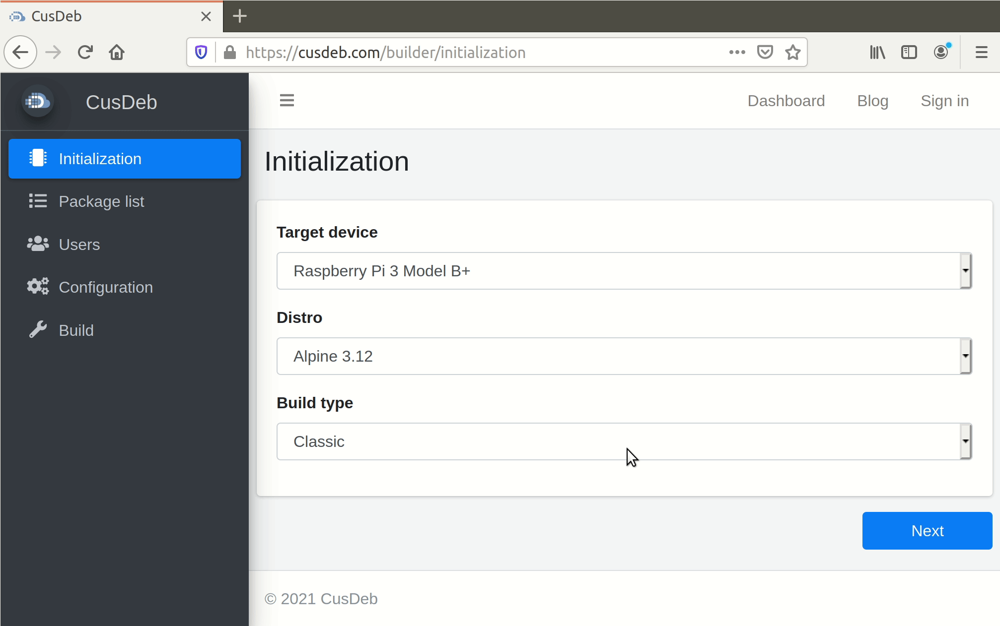

[](https://github.com/tolstoyevsky/cusdeb-web-client/actions/workflows/checks.yml/badge.svg)
[](https://cusdeb.com)

# CusDeb Web Client

CusDeb Web Client exposes the whole [CusDeb](https://cusdeb.com)'s functionality to users, including customizing OS images for wide variety of single-board computers.



## Table of Contents

- [Configuration](#configuration)
- [Deployment for development purposes](#deployment-for-development-purposes)
- [Authors](#authors)
- [Licensing](#licensing)

## Configuration

CusDeb Web Client can be configured via the following environment variables (called parameters).

| Parameter              | Description                                                                                                                           | Default                                     |
|------------------------|---------------------------------------------------------------------------------------------------------------------------------------|---------------------------------------------|
| `BLACKMAGIC_URL`       | The URL of the API endpoint provided by the [Black Magic](https://github.com/tolstoyevsky/blackmagic) service.                        | `ws://localhost:8002/bm/token/%token`       |
| `CUSDEB_ANONYMOUS_URL` | The address of the [CusDeb Anonymous](https://github.com/tolstoyevsky/cusdeb-anonymous) service.                                      | `http://localhost:8007`                     |
| `CUSDEB_API_URL`       | The address of the [CusDeb API](https://github.com/tolstoyevsky/cusdeb-api) service.                                                  | `http://localhost:8001`                     |
| `CUSDEB_HELPIK_URL`    | The address of the [CusDeb Helpik](https://github.com/tolstoyevsky/cusdeb-helpik) service.                                            | `http://localhost:8005`                     |
| `CUSDEB_TZ_URL`        | The address of the [CusDeb Tz](https://github.com/tolstoyevsky/cusdeb-tz) service.                                                    | `http://localhost:8006`                     |
| `DOMINION_URL`         | The URL of the API endpoint provided by the [Dominion](https://github.com/tolstoyevsky/dominion) service.                             | `ws://localhost:8003/dominion/token/%token` |
| `HOST`                 | The address of the machine Webpack Dev Server is running on. It helps to check CusDeb Web Client on other devices in a local network. | `0.0.0.0`                                   |
| `PORT`                 | The port which Webpack Dev Server is running on.                                                                                      | `8000`                                      |
| `SENTRY_DSN`           | A [Sentry](http://sentry.io) DSN (Data Source Name) to tell the Sentry SDK where to send events.                                      |                                             |

## Deployment for development purposes

1. Install [Node](https://nodejs.org) 12.

2. Install dependencies by executing.

    ```
    $ npm install
    ```

    Note that CusDeb Web Client contains optional dependencies. Here is an alternative command to ignore them:

    ```
    $ npm install --no-optional
    ```

3. Define environment variables in the `.env` file in the project root directory.

4. Run [Webpack Dev Server](https://webpack.js.org/configuration/dev-server) by executing.

    ```
    $ npm run dev
    ```

## Authors

See [AUTHORS](AUTHORS.md).

## Licensing

CusDeb Web Client is available under the [Apache License, Version 2.0](LICENSE).

